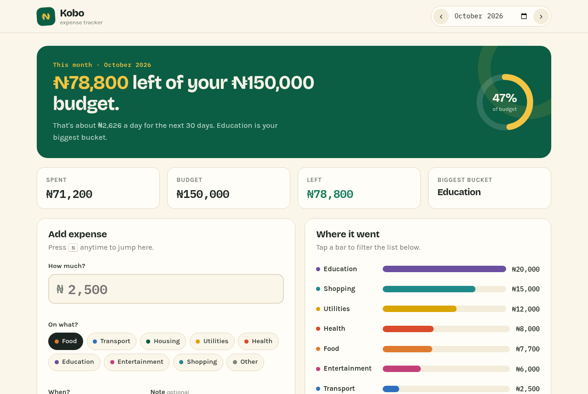
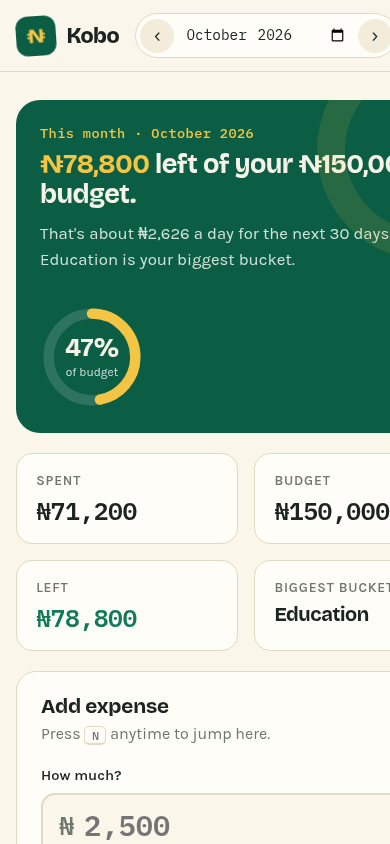

# Kobo · Expense Tracker

I built Kobo because most budgeting apps want an account, a bank login, or a subscription before they'll tell you where your money went. Kobo doesn't. You type what you spent, pick a category, and it tells you in plain words how you're doing this month, including how much you can still spend per day without blowing your budget.

It's made for students and young workers in Nigeria (amounts are in Naira), but it works for anyone. All your data stays in your browser's `localStorage`. There are no accounts and nothing goes to a server.

**Live demo:** https://dave-4u.github.io/projects/expense-tracker/



<p align="center"></p>

## Quickstart

No build step. Pick one:

```bash
npm start                 # serves on http://localhost:8080 (Node 18+, no installs needed)
# or
python3 -m http.server 8080
# or just double-click index.html
```

Run the tests (unit tests + a real-browser smoke test):

```bash
npm install   # only pulls playwright-core; it uses the Chrome you already have
npm test
```

## Features

- **A plain-English headline**, e.g. "₦78,800 left of your ₦150,000 budget. That's about ₦2,626 a day for the next 30 days."
- **Budget ring** that fills as you spend and turns red when you go over
- **Quick category chips** (use the arrow keys to move between them), date, and an optional note
- **"Where it went"** bar chart. Tap a bar to filter your receipts to that category.
- **Receipts list** with search, edit, and delete. Every delete has an **Undo**.
- **Month switcher**. Use the arrows, the picker, or the `←` / `→` keys.
- **Export CSV** for the current view
- **Keyboard shortcuts:** `N` new expense · `/` search · `←` `→` change month · `Esc` cancel an edit
- Responsive down to small phones, visible focus states, labelled inputs, and support for reduced motion

## Tech stack

Vanilla HTML, CSS, and JavaScript. Fonts are Bricolage Grotesque, Karla, and IBM Plex Mono (Google Fonts). The pure logic in `lib.js` is shared by the app and the Node tests. The tests use `node:test` plus `playwright-core` driving a local Chrome.

```
index.html      markup
styles.css      the "receipt paper" theme
lib.js          pure helpers (totals, CSV, daily allowance)
app.js          UI and state
scripts/serve.js  zero-dependency static server
tests/          unit + browser smoke tests
```

## Roadmap

- Recurring expenses (rent, data subscriptions)
- Income tracking and a simple savings goal
- Import from CSV / bank statement
- Optional sync between devices (opt-in, still no account required)

## License

MIT © Adegboro David Oluwadamilare
